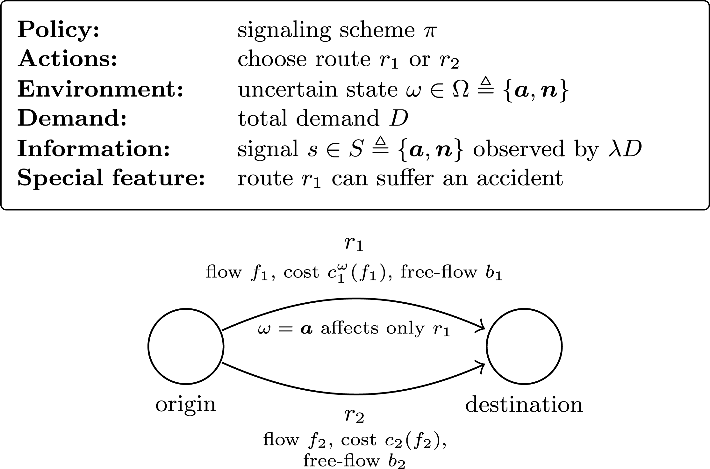

# Summer UROP 26 Assessment

Hi there!

This is a new format for me to gauge your skills and interest in the topic at hand: game theory in the transportation context. For some reason, this year I got a lot of requests for summer UROPs and, to make the experience both interesting and useful for both of us, I think that it's fair to have a look through:

- Your (basic) Python skills
- Your ability to work independently
- Your ability to understand a problem and contribute to it

## About UROP-ing with me

I work very closely with my UROPs (feel free to talk to `dtemkin` or `yevivian` for some first-hand reports). Therefore, I want to maximize my ability to understand your work and, equally, your learning. To do so, however, I only feel comfortable (and past experience has shown) with one "main" UROP at a time, particularly in the summer, where part of our interactions will be remote. Therefore, this assessment is intended to lay the foundation for high-quality research time.

## The Assessment

I have structured the assessment around a pre-print of [Manxi Wu](https://sites.google.com/view/manxi-wu/home), who has also been supervised by my co-PI [Saurabh Amin](https://cee.mit.edu/people_individual/saurabh-amin/). The paper is available [online](https://arxiv.org/abs/1908.07105) or [in the `paper` folder](./paper/Wu%20and%20Amin%20-%202019%20-%20Information%20Design%20for%20Regulating%20Traffic%20Flows%20under%20Uncertain%20Network%20State.pdf). The paper seeks to address the concern of routing systems (think Google Maps) suggesting routes that can lead to severe congestion on urban streets, such as routing commuters through residential streets. How can cities and transportation agencies (called "central authorities") reduce the traffic above certain limits (spillover) by changing what information one provides travelers?

  

Thus, the paper studies information design in a stylized two-route $\{r_1,r_2\}$ congestion game with an uncertain network state. Route $r_1$ can experience an accident (which increases congestions) with probability $p$, while $r_2$ is not prone to accidents. A central authority then observes the realized state and commits to a noisy signaling scheme for a fraction $\lambda$ of travelers among the total demand $D$.

The key point is that fully revealing an accident to too many informed travelers can trigger excessive diversion from $r_1$ to $r_2$, creating spillover congestion on the alternate route $r_2$. The paper then characterizes the optimal signaling scheme that minimizes expected spillover on $r_2$ above a threshold $\tau$, under the Bayesian Wardrop equilibrium. Its main takeaway is that partial and selective revelation can outperform both no information and full revelation.

What Manxi figured out, and which is really cool, is that in this specific setting, we can actually derive closed-form solutions for the optimal signaling scheme $\pi$ of the central authority. This is what I have mostly implemented for you from the paper in the various files in the `src` folder.

If you are interested, there's another paper by Vasserman et al., who generalize a similar setting and names it: [Implementing the Wisdom of Waze](https://www.ijcai.org/Proceedings/15/Papers/099.pdf)

**Why is this important, you ask?** Because I am currently looking into [Bayesian Persuasion](https://en.wikipedia.org/wiki/Bayesian_persuasion) in the mobility context and will be doing more on this and related topics over the summer. Ideally, I want you to contribute to the research to the point that we can seriously consider publishing your contributions. This, however, is not strictly necessary.

### Process overview

There are two parts to this: this assessment and a chat with me in person, where we can go over the code, your results, and your thoughts. I know that this time of the semester is busy, and I don't want you to "waste" a lot of time on this, no matter how cool it is. Therefore, I would like you to figure out the few things I broke in the code on purpose (sorry), run the experiments to get the same results as in the paper (so cool!), and then think about some aspects of the problem we can discuss.

I would like you to work on this when you get time and muse and to come back to me whenever you think you've achieved what you wanted. The only real deadline is the one set by the UROP office. Also, if you feel like this is too much work or you don't feel comfortable working on such topics / with code, that is also `OK`. You can always approach other members or me in [the Zardini Group](https://zardini.mit.edu/) for UROPs at any stage of your UG, and we'll be happy to see how we can include you!

### GenAI "Policy"

For the assessment, I expect you not to use GenAI whatsoever. Disable your copilot and don't ask ChatGPT/Claude/Parley/Perplexity/`<WHATEVER_IS_HIP_ATM>` - in the end, this is really for you and me to understand if we want to commit to 3 months of working together, not to see how good of a prompt engineer you are.

~~Okay, if you really struggle to set up the environment on your machine, I'm _OK_ with you using GenAI for that.~~

Never mind, [`uv` by Astral](https://docs.astral.sh/uv/getting-started/installation/) really has great docs that should see you through it.

## Tasks

Now, this is the work I ask you to do:

1. Have a look through the paper (see the `paper` folder) and through the `src` folder.
2. Set up the environment using `uv` locally on your machine.
3. Try to run `experiments.py` for which you will have to address all the `TODO`'s that I put out for you.
4. Write me an email when you think you're done or at a good stage.
